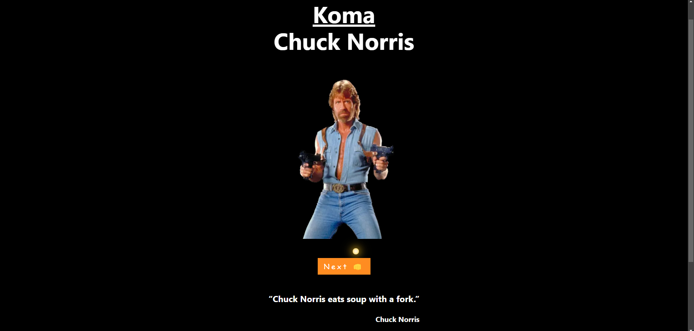
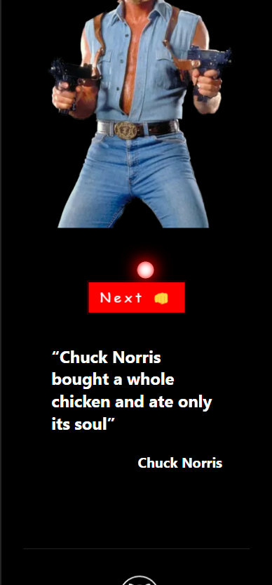

<h1 align='center'> Koma - Chuck Norris API 👊</h1>
<h3 align='center'>Simple web app on NextJS with Chuck Norris API and some animations features (for API test)</h3>
 

 

<h2 align='center'> Screenshots:</h2>

API - https://rapidapi.com/matchilling/api/chuck-norris/
